# Bhavya Darji - Personal Portfolio

This is the personal portfolio repository for **Bhavya Darji**, a Software Development Engineer. The portfolio showcases my experience, projects, skills, and certifications. 

Built with modern web technologies, this project provides a fast, responsive, and visually appealing digital presence.

## 📸 Screenshots

<!-- You can adjust the width attribute (e.g. width="800", width="600", width="100%") to resize any image -->

### Hero & Introduction
<p align="center">
  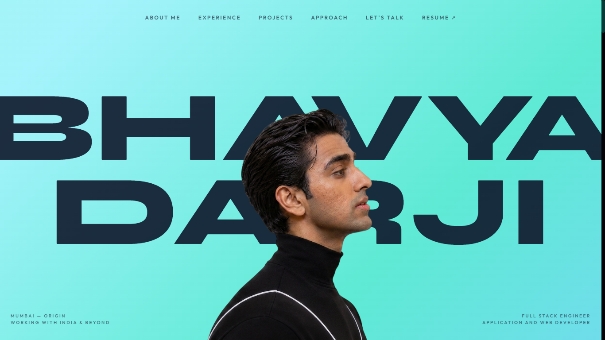
</p>

### Preloader Animation
<p align="center">
  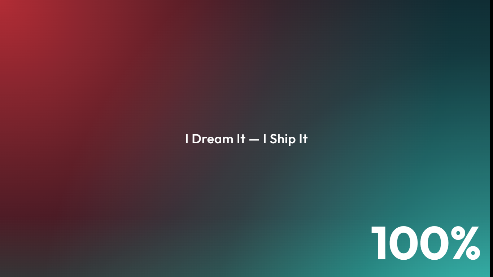
</p>

### About Me & Education
<p align="center">
  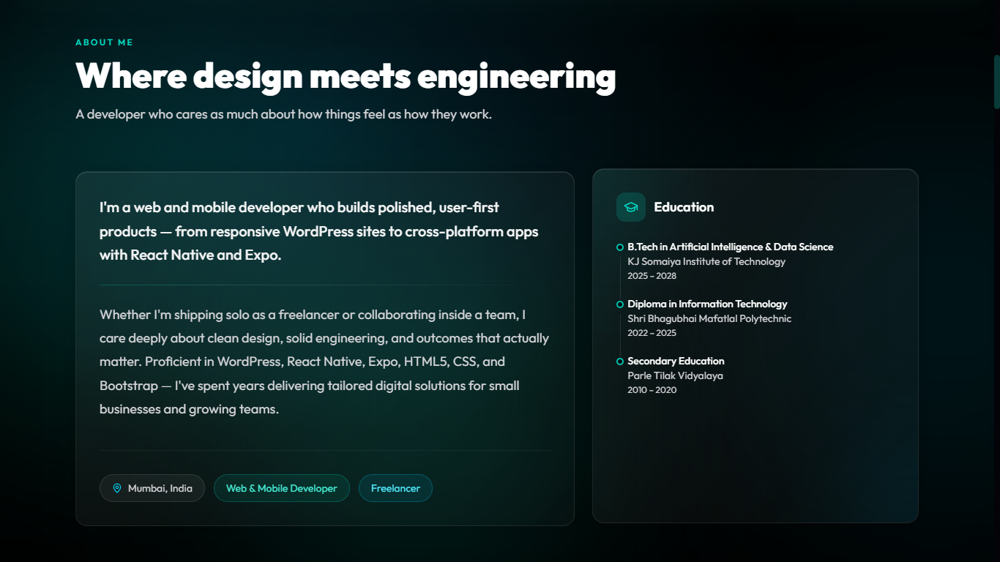
</p>

### Professional Journey & Experience
<p align="center">
  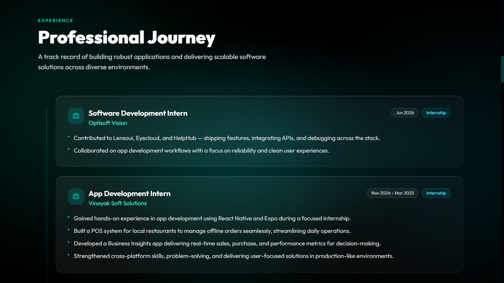
</p>

<p align="center">
  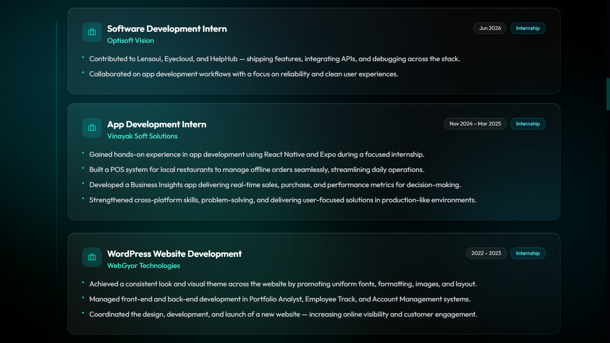
</p>

### Featured Projects & Ventures
<p align="center">
  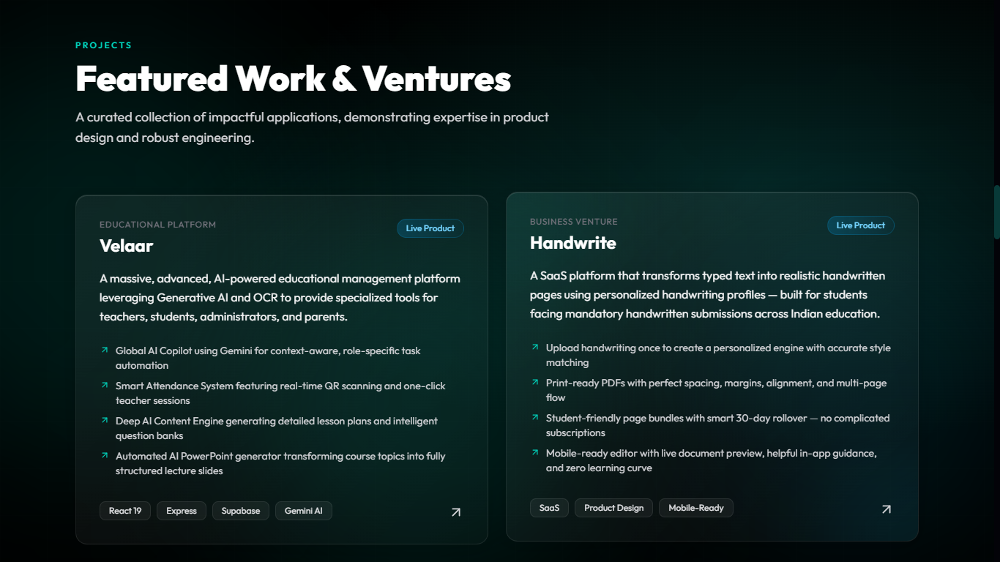
</p>

<p align="center">
  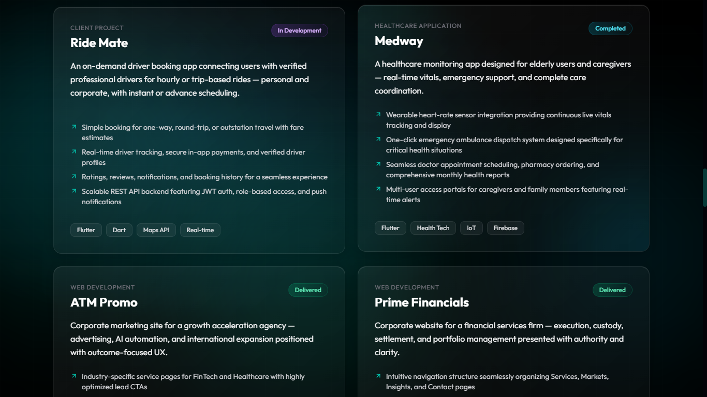
</p>

### Technical Expertise & Skills
<p align="center">
  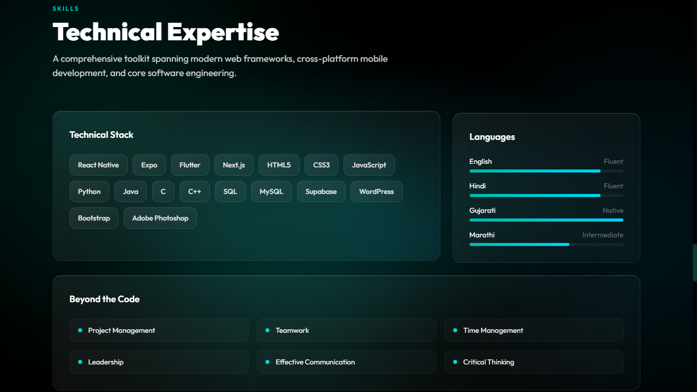
</p>

### Licenses & Certifications
<p align="center">
  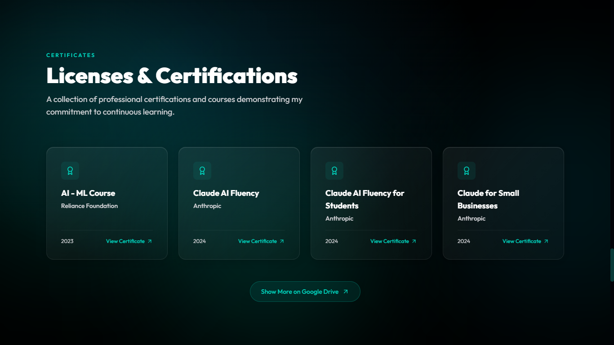
</p>

### Interactive Contact & Footer
<p align="center">
  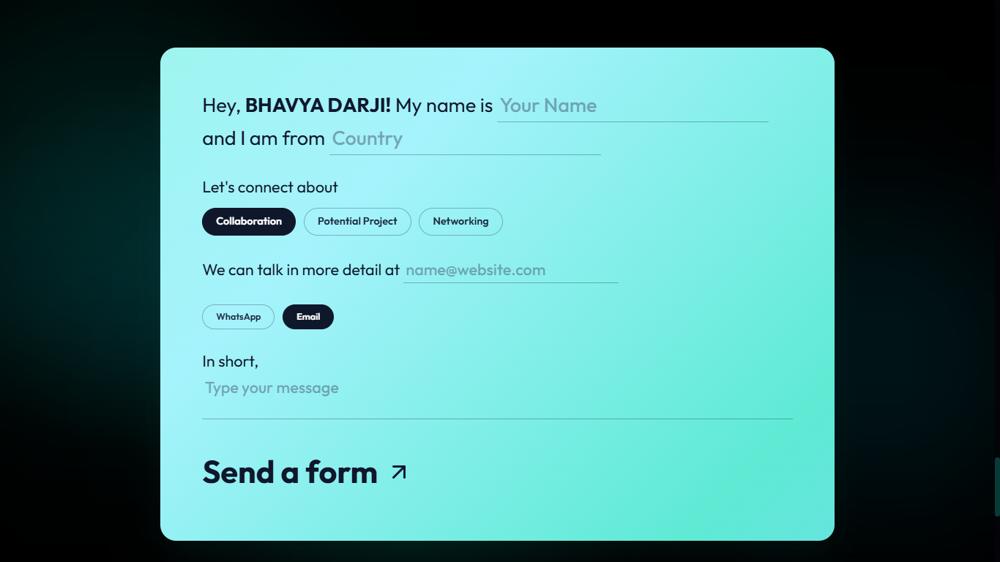
</p>

<p align="center">
  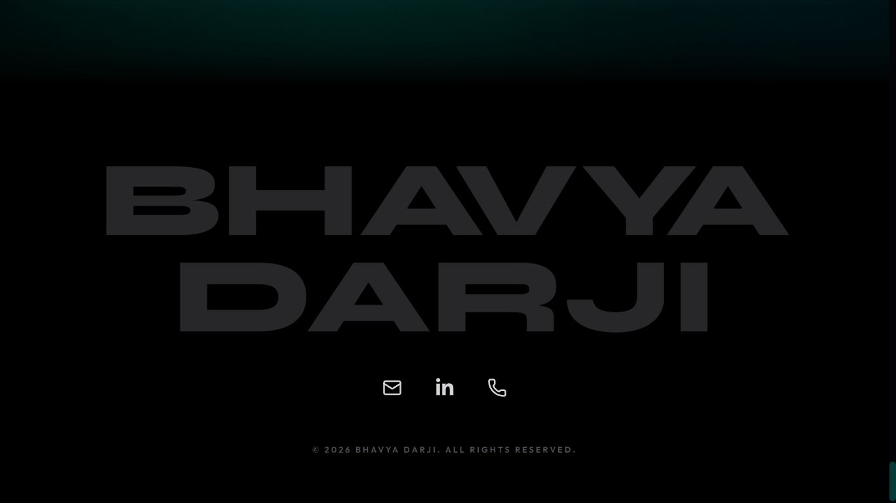
</p>

## 🚀 Tech Stack

- **Framework**: [Next.js](https://nextjs.org) (App Router)
- **Language**: TypeScript
- **Styling**: Tailwind CSS
- **Animations**: Framer Motion
- **Icons**: Lucide React & React Icons

## 🛠️ Getting Started

First, clone the repository and install the dependencies:

```bash
npm install
# or
yarn install
# or
pnpm install
# or
bun install
```

Then, run the development server:

```bash
npm run dev
# or
yarn dev
# or
pnpm dev
# or
bun dev
```

Open [http://localhost:3000](http://localhost:3000) with your browser to see the result.

## 📂 Project Structure

- `src/app/`: Contains the Next.js app router pages, layouts, and global styles.
- `src/components/`: Reusable React UI components used across the portfolio.
- `src/data/`: Centralized data file (`portfolio.ts`) containing all the content (experience, projects, skills, etc.) for easy updating.
- `scripts/`: Contains utility scripts (e.g., generating the resume).

## 📝 Customization

All the personal information, projects, and experiences are managed centrally. To update the portfolio content, simply edit the `src/data/portfolio.ts` file. The portfolio UI will automatically reflect the changes.

## 📜 Scripts

- `npm run dev`: Starts the Next.js development server.
- `npm run build:resume`: Runs the script to dynamically generate the resume.
- `npm run build`: Generates the resume and builds the Next.js application for production deployment.
- `npm run start`: Starts the production server.
- `npm run lint`: Runs ESLint to check for code quality and issues.

## 🌐 Contact

- **Email**: [bhavyadarji462@gmail.com](mailto:bhavyadarji462@gmail.com)
- **LinkedIn**: [Bhavya Darji](https://www.linkedin.com/in/bhavya-darji-181573242/)

---

<p align="center">Made with ❤️ by <a href="https://bhavya-darji.vercel.app/" target="_blank" rel="noopener noreferrer"><strong>Bhavya Darji</strong></a></p>
